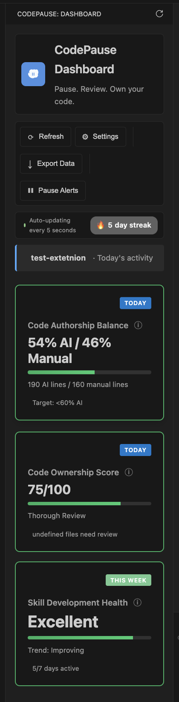

<div align="center">
  
  <h1 style="margin-bottom:0">CodeVibe</h1>
  <p><strong>Write it. Review it. Prove it.</strong><br>
  <span style="opacity:.7">VS Code extension + standalone verifier for AI-assisted coding — in class and in production</span></p>

  <p>
    <a href="https://marketplace.visualstudio.com/items?itemName=codepause.codevibe-verify"></a>
    <a href="https://www.npmjs.com/package/codevibe-verify"></a>
    
    
    <a href="LICENSE.md"></a>
  </p>
</div>

```
$ code .                    # open your repo
$ # ... code with Copilot / Cursor / Claude ...

$ npx codevibe-verify reports/hw3.report.json

✔ hw3.report.json — INTEGRITY OK — COMPLIANCE PASS
  Assignment: HW3 - Binary Trees (asgn-hw3) | Student: you@uni.edu | 2026-09-21T15:18:03Z
  Authorship: 18.4% AI (limit 30%)  ✓ PASS — 12 permitted + 0 prohibited
  Ownership:  92.0 /100 (min 40)      ✓ PASS — 3 reviewed, 0 unreviewed
  Violations: 0 — none

────────────────────────────────────────────────────────────
Summary: 1 file — 1 integrity OK — 1 compliant
Result: All reports authentic and compliant.
```

One extension. One hash. No hand-waving about who wrote what.

---

## What this is

**CodeVibe tracks AI vs. human code where you write it — in VS Code — and gives you a signed report you can hand in.**

- For **students**: see in real time how much of your assignment is AI, whether you actually reviewed it, and export a `*.report.json` with a `sha256` integrity seal.
- For **teachers**: run `codevibe-verify` offline, without VS Code, to confirm the report wasn’t edited and see at a glance if policy passed. No network, no trust-me server.
- For **teams**: same dashboard without the assignment layer — keep AI useful without losing the ability to read your own diff.

It is not a linter, not a grader, not a spy. All data stays in `~/.codepause/` as local SQLite (`sql.js` WASM). No code leaves the machine.

---

## The ledger, not the lecture

Most AI trackers lecture you. CodeVibe keeps a ledger.

| What we count | Where it lives | What you do with it |
|---|---|---|
| **Authorship** — `AI lines / total lines` per day & per assignment | Dashboard “AI authorship” meter + `report.metrics.authorship` | Stay under `policy.maxAuthorshipPercentage` (e.g. 30%) |
| **Ownership** — `0–100` review score from time-in-focus, scrolling, cursor, edits | Dashboard “Ownership” meter + `report.metrics.ownership` | Stay above `policy.minOwnershipScore` (e.g. 40) |
| **Policy violations** — `agentic-use`, `authorship-exceeded`, `ownership-below-minimum`, `unreviewed-large-paste`, `tracking-gap` | Dashboard policy panel + `report.metrics.violations[]` | Zero `high`/`medium` for compliance |
| **Integrity** — `sha256(canonical(report − integrity − generatedAt))` | `report.integrity.hash` | `codevibe-verify` recomputes and compares with `timingSafeEqual` |

If the hash matches, the numbers weren’t edited after export. `generatedAt` is *not* signed, so re-exporting the same data gives the same hash.

---

## Dashboard

<div align="center">
  
  <p><em>Assignment panel: name, dates, two meters with policy ticks, violation list with severity border — the same data that goes into the report.</em></p>
</div>

- **Three cards:** `Authorship` (today) + `Ownership` (today) + `Skill Health` (7-day trend). Not gamification — just `Excellent / Good / Needs Attention`.
- **Weekly trend, tool breakdown, session stats** collapsed by default.
- **Assignment panel** (when active): course, repo link, meters, `Policy violations` stack, `Export report for submission`.

---

## Assignment workflow

### Student (in VS Code)

1. **Create / activate** — `Cmd+Shift+P` → `CodeVibe: Create Assignment` → name, `YYYY-MM-DD` start/end, `maxAuthorship%`, `minOwnership`. Or `CodeVibe: Activate Assignment` to switch.
2. **Code** — use Copilot / Cursor / Claude Code as usual. CodeVibe buffers events, aggregates every 5 min, debounces dashboard refresh (60s).
3. **Review** — open AI-generated files, scroll, move cursor, edit. Score `≥70` = thorough, `40–69` = light. Dashboard shows `Files needing review`.
4. **Export** — dashboard `Export report for submission` or `CodeVibe: Export Assignment Report` → pick save location, optionally enter `studentIdentifier`, `repoHeadCommit` is auto-captured via `git rev-parse HEAD`. You get `hw3.report.json`:
   ```json
   {
     "reportVersion": "1.0",
     "assignmentId": "asgn-hw3-...",
     "assignmentName": "HW3 - Binary Trees",
     "generatedAt": 1726920000000,
     "studentIdentifier": "you@uni.edu",
     "repoHeadCommit": "abc123d…",
     "metrics": { "authorship": {...}, "ownership": {...}, "violations": [] },
     "policy": { "maxAuthorshipPercentage": 30, "minOwnershipScore": 40, ... },
     "integrity": { "algorithm": "sha256", "hash": "a57f46b…" }
   }
   ```

### Teacher / reviewer (no VS Code needed)

```bash
# One file
npx codevibe-verify hw3.report.json

# Many files, strict compliance, machine output for CI
npx codevibe-verify reports/*.report.json --strict --json | jq

# Piped
cat hw3.report.json | npx codevibe-verify -

# Also available as alias
npx verify-assignment-report hw3.report.json
```

**Output is two checks at once** — `INTEGRITY` and `COMPLIANCE`:

```
✔ hw3.report.json — INTEGRITY OK — COMPLIANCE PASS
  Assignment: HW3 - Binary Trees (asgn-hw3-...) | Student: you@uni.edu | 2026-09-21T15:18:03Z
  Authorship: 18.4% AI (limit 30%)  ✓ PASS
  Ownership:  92.0 /100 (min 40)      ✓ PASS — 3 reviewed, 0 unreviewed
  Violations: 0 — none

✘ hw2.report.json — INTEGRITY FAIL — COMPLIANCE FAIL
  Stored:    a57f46b…
  Recomputed: ff5f44f…
  Reason: hash mismatch - the report has been modified after export

────────────────────────────────────────────────────────────
Summary: 2 files — 1 integrity OK, 1 FAIL — 1 compliant, 1 non-compliant
```

`--strict` makes a compliant FAIL exit `1` (default: exit `1` only on integrity FAIL, `2` on usage/IO). `--verbose` prints each violation’s message, `--no-color` disables ANSI, `--quiet` suppresses per-file details.

The verifier is a single `~20KB` Node file with zero deps (`fs` + `crypto` only). You can `curl -O` `scripts/verify-assignment-report.js` and run it offline. It re-implements `canonicalize` line-for-line from `src/assignments/AssignmentReportGenerator.ts:33` so a teacher doesn’t have to trust the extension that produced the report.

---

## Detection — 99.9% without config

No per-tool setup. Five signals, highest confidence wins:

1. **Inline Completion API** `high` — official VS Code API (Copilot, Cursor tab)
2. **Large paste** `high` — `>100 chars`, code-shaped (braces/keywords/newlines)
3. **External file change** `high` — file modified while closed (agent/composer)
4. **Git commit marker** `absolute` — `Co-Authored-By: Claude`, `@claude-code`
5. **Change velocity** `medium` — `>500 chars in <1s` (filtered if alone)

Deduplication: `src/tracking/EventDeduplicator.ts:39` (`file:timestamp:lines:linesRemoved:chars`, 1s window). Review scoring: `src/core/FileReviewSessionTracker.ts:445` (`totalTimeInFocus` only if `scroll>=1` or `cursor>=5` or `editsMade`, 80 pts thorough, etc.).

Language-aware: `src/core/ReviewQualityAnalyzer.ts` scales expected review time by complexity (`Rust 2.0×`, `C++ 1.8×`, `TS/JS 1.5×`, `Python/Go 1.4×` …).

---

## Install

**VS Code Marketplace** (extension ID `codepause.codevibe-verify`, display name `CodeVibe`):

- VS Code → `Cmd+Shift+X` → search `CodeVibe` → Install
- or `code --install-extension codevibe-verify-0.1.7.vsix`

**From source:**

```bash
git clone https://github.com/codepause-dev/codepause-extension.git
cd codepause-extension
npm install
npm run compile          # tsc → out/
npm test                 # 1438 tests
npm link                 # gives you `codevibe-verify` + `verify-assignment-report` bins
codevibe-verify --help
```

**Requirements:** VS Code `^1.85.0`, Node `>=20`, git repo recommended (falls back to baseline tracking with warning, `src/extension.ts:270`).

---

## Quick start

1. **Level** — first launch asks `Junior / Mid / Senior` (sets `maxAIPercentage` 40/60/75 and `blindApprovalTime` 5s/3s/2s, `src/types/index.ts:981`). Change anytime: `CodeVibe: Change Experience Level`.
2. **Open dashboard** — `Cmd+Shift+P` → `CodeVibe: Open Dashboard` or activity bar `CodeVibe`.
3. **Code** — write as usual. Snooze: `CodeVibe: Snooze Alerts for Today`. Refresh: `CodeVibe: Refresh Dashboard` (force HTML regen + aggregation).
4. **Export / Verify** — see assignment workflow above.

---

## Commands

| Command | What it does |
|---|---|
| `CodeVibe: Open Dashboard` | Reveal `codePause.dashboardView` + `refresh(true)` |
| `CodeVibe: Refresh Dashboard` | `metricsCollector.triggerAggregation()` + dashboard/status bar refresh |
| `CodeVibe: Create / Activate / Deactivate Assignment` | `AssignmentManager.ts:29-56` lifecycle |
| `CodeVibe: Export Assignment Report` | `AssignmentReportGenerator.ts:87` → save `*.report.json` |
| `CodeVibe: Show Assignment Status` | Modal with `authorship%`, `ownership`, violation list |
| `CodeVibe: Change Experience Level` | Update `ThresholdManager.ts` + `ConfigRepository.ts` |
| `CodeVibe: Clear All Data` | Deletes `~/.codepause/*.db` + `.vscode/codepause-baselines.json` |
| `CodeVibe: Show Database Info` | `DatabaseManager.ts` stats |

Dashboard also posts `refresh`, `openSettings`, `snooze`, `exportAssignmentReport` via webview `src/ui/DashboardHtml.ts:2135` → `DashboardProvider.ts:84`.

---

## Configuration

`Cmd+,` → search `CodeVibe`:

- `codePause.experienceLevel` `junior|mid|senior` (`mid`)
- `codePause.blindApprovalThreshold` `2000` ms
- `codePause.alertFrequency` `low|medium|high` (`medium`)
- `codePause.enableGamification` `false`
- `codePause.anonymizePaths` `true`

Thresholds live in `src/core/ThresholdManager.ts`, alerts in `src/alerts/AlertEngine.ts:87`.

---

## Development

```
npm run compile      # tsc -p ./
npm run watch        # tsc --watch
npm run lint         # eslint src --ext ts
npm test             # jest --coverage (1438 tests, 42 suites)
npx vsce package     # → codevibe-verify-0.1.7.vsix (includes out/ + node_modules/sql.js)
```

Structure: `src/storage` (SQLite `sql.js` WASM, `DatabaseManager.ts:135` wasm path), `src/core` (`MetricsCollector.ts` hub, `PolicyEngine.ts:82` violations), `src/trackers` (`UnifiedAITracker.ts`), `src/ui` (`DashboardHtml.ts:11` template literal), `src/cli/verify.ts` (standalone verifier), `src/assignments` (manager + generator). See `ARCHITECTURE.md`.

---

## Privacy

- `100%` local. SQLite files in `~/.codepause/` (workspace-specific `~/.codepause/<hash>.db`), no code content stored, `files: ["out","resources","scripts/verify-assignment-report.js"]` for npm, `.vscodeignore` keeps `node_modules/sql.js` + `date-fns` only.
- `codePause.anonymizePaths` hashes file paths if you enable it.
- Telemetry: `TelemetryService.ts` respects VS Code global `telemetry.enableTelemetry` and `codePause.enableTelemetry` (default `true`, anonymous only).

---

## License

**Business Source License 1.1** — free for personal & internal company use, not for a competing commercial extension/SaaS. Converts to `Apache 2.0` on `2027-01-04`. Commercial: `license@codepause.dev`. See `LICENSE.md` + `LICENSE-COMMERCIAL.md`.

---

<div align="center">

**CodeVibe is a ledger, not a judge.**

Pause. Review. Own your code. `codevibe-verify` your proof.

<a href="https://github.com/codepause-dev/codepause-extension/issues">Report bug</a> · <a href="https://github.com/codepause-dev/codepause-extension/discussions">Discussion</a> · <a href="ARCHITECTURE.md">Architecture</a>

</div>
